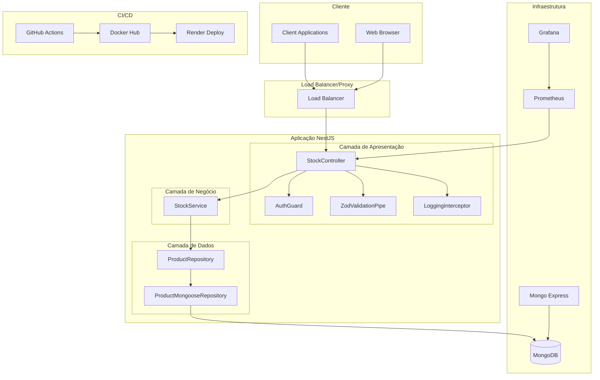
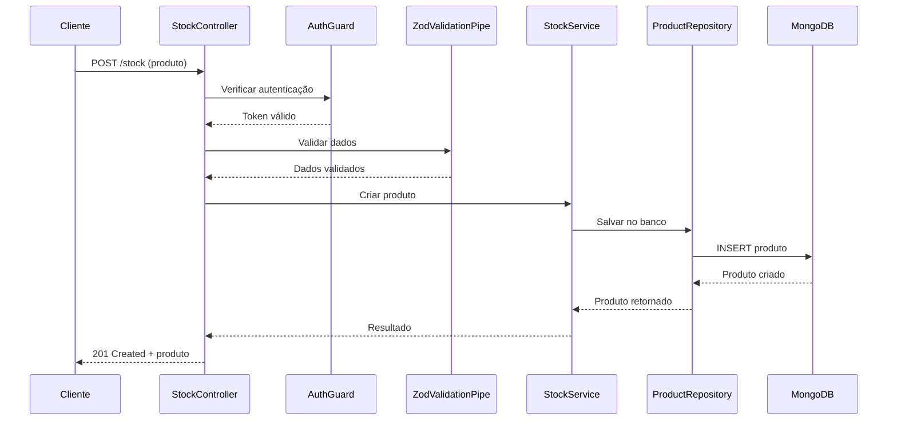
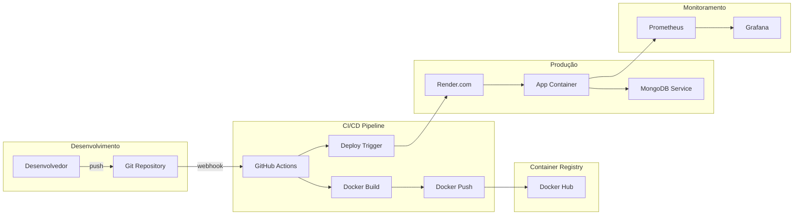
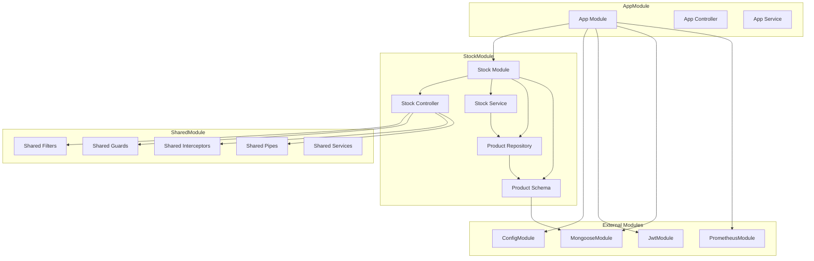
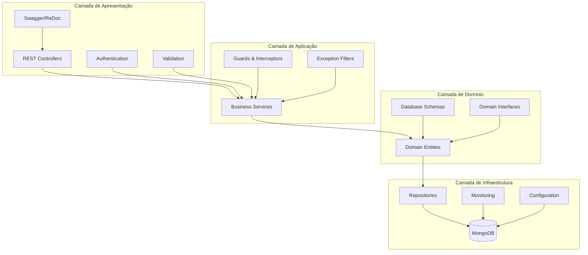

# Diagramas de Arquitetura

## Diagrama de Arquitetura do Sistema

```mermaid
graph TB
    subgraph "Cliente"
        CLI[Client Applications]
        WEB[Web Browser]
    end

    subgraph "Load Balancer/Proxy"
        LB[Load Balancer]
    end

    subgraph "Aplicação NestJS"
        subgraph "Camada de Apresentação"
            CTRL[StockController]
            GUARD[AuthGuard]
            PIPE[ZodValidationPipe]
            INT[LoggingInterceptor]
        end
        
        subgraph "Camada de Negócio"
            SVC[StockService]
        end
        
        subgraph "Camada de Dados"
            REPO[ProductRepository]
            MONGO_REPO[ProductMongooseRepository]
        end
    end

    subgraph "Infraestrutura"
        MONGO[(MongoDB)]
        PROMETHEUS[Prometheus]
        GRAFANA[Grafana]
        MONGO_EXP[Mongo Express]
    end

    subgraph "CI/CD"
        GH[GitHub Actions]
        DOCKER[Docker Hub]
        RENDER[Render Deploy]
    end

    CLI --> LB
    WEB --> LB
    LB --> CTRL
    
    CTRL --> GUARD
    CTRL --> PIPE
    CTRL --> INT
    CTRL --> SVC
    
    SVC --> REPO
    REPO --> MONGO_REPO
    MONGO_REPO --> MONGO
    
    PROMETHEUS --> CTRL
    GRAFANA --> PROMETHEUS
    MONGO_EXP --> MONGO
    
    GH --> DOCKER
    DOCKER --> RENDER
```

## Diagrama de Fluxo de Dados

```mermaid
sequenceDiagram
    participant C as Cliente
    participant API as StockController
    participant G as AuthGuard
    participant V as ZodValidationPipe
    participant S as StockService
    participant R as ProductRepository
    participant DB as MongoDB

    C->>API: POST /stock (produto)
    API->>G: Verificar autenticação
    G-->>API: Token válido
    API->>V: Validar dados
    V-->>API: Dados validados
    API->>S: Criar produto
    S->>R: Salvar no banco
    R->>DB: INSERT produto
    DB-->>R: Produto criado
    R-->>S: Produto retornado
    S-->>API: Resultado
    API-->>C: 201 Created + produto
```

## Diagrama de Deployment

```mermaid
graph LR
    subgraph "Desenvolvimento"
        DEV[Desenvolvedor]
        GIT[Git Repository]
    end

    subgraph "CI/CD Pipeline"
        GA[GitHub Actions]
        BUILD[Docker Build]
        PUSH[Docker Push]
        DEPLOY[Deploy Trigger]
    end

    subgraph "Container Registry"
        DH[Docker Hub]
    end

    subgraph "Produção"
        RENDER[Render.com]
        APP[App Container]
        MONGODB[MongoDB Service]
    end

    subgraph "Monitoramento"
        METRICS[Prometheus]
        DASH[Grafana]
    end

    DEV -->|push| GIT
    GIT -->|webhook| GA
    GA --> BUILD
    BUILD --> PUSH
    PUSH --> DH
    GA --> DEPLOY
    DEPLOY --> RENDER
    RENDER --> APP
    APP --> MONGODB
    APP --> METRICS
    METRICS --> DASH
```

## Diagrama de Modules (NestJS)

```mermaid
graph TD
    subgraph "AppModule"
        AM[App Module]
        AC[App Controller]
        AS[App Service]
    end

    subgraph "StockModule"
        SM[Stock Module]
        SC[Stock Controller] 
        SS[Stock Service]
        PR[Product Repository]
        PS[Product Schema]
    end

    subgraph "SharedModule"
        SF[Shared Filters]
        SG[Shared Guards]
        SI[Shared Interceptors]
        SP[Shared Pipes]
        SSV[Shared Services]
    end

    subgraph "External Modules"
        CFG[ConfigModule]
        JWT[JwtModule]
        MONGO[MongooseModule]
        PROM[PrometheusModule]
    end

    AM --> SM
    AM --> CFG
    AM --> JWT
    AM --> MONGO
    AM --> PROM
    
    SM --> SC
    SM --> SS
    SM --> PR
    SM --> PS
    
    SC --> SF
    SC --> SG
    SC --> SI
    SC --> SP
    
    SS --> PR
    PR --> PS
    PS --> MONGO
```

## Arquitetura em Camadas

```mermaid
graph TB
    subgraph "Camada de Apresentação"
        direction TB
        REST[REST Controllers]
        DOCS[Swagger/ReDoc]
        AUTH[Authentication]
        VALID[Validation]
    end

    subgraph "Camada de Aplicação"
        direction TB
        SERVICES[Business Services]
        GUARDS[Guards & Interceptors]
        FILTERS[Exception Filters]
    end

    subgraph "Camada de Domínio"
        direction TB
        ENTITIES[Domain Entities]
        SCHEMAS[Database Schemas]
        INTERFACES[Domain Interfaces]
    end

    subgraph "Camada de Infraestrutura"
        direction TB
        REPOS[Repositories]
        DATABASE[(MongoDB)]
        MONITOR[Monitoring]
        CONFIG[Configuration]
    end

    REST --> SERVICES
    DOCS --> REST
    AUTH --> SERVICES
    VALID --> SERVICES
    
    SERVICES --> ENTITIES
    GUARDS --> SERVICES
    FILTERS --> SERVICES
    
    ENTITIES --> REPOS
    SCHEMAS --> ENTITIES
    INTERFACES --> ENTITIES
    
    REPOS --> DATABASE
    MONITOR --> DATABASE
    CONFIG --> DATABASE
```